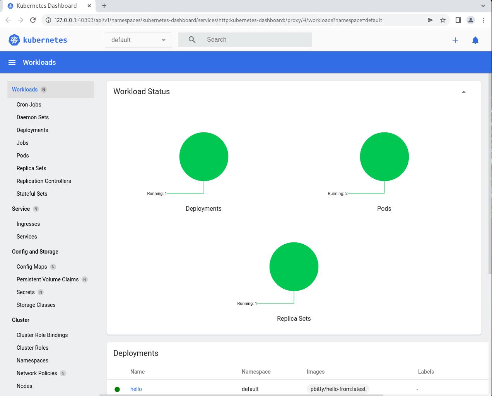

# MINIKUBE MULTINODE ON KVM
---
[https://kubernetes.io/docs/tasks/tools/](https://kubernetes.io/docs/tasks/tools/)

[https://minikube.sigs.k8s.io/docs/](https://minikube.sigs.k8s.io/docs/)

[https://minikube.sigs.k8s.io/docs/tutorials/multi_node/](https://minikube.sigs.k8s.io/docs/tutorials/multi_node/)

[https://howtoforge.es/aprender-kubernetes-localmente-a-traves-de-minikube-en-manjaro-archlinux/](https://howtoforge.es/aprender-kubernetes-localmente-a-traves-de-minikube-en-manjaro-archlinux/)

[https://www.digihunch.com/2021/09/single-node-kubernetes-cluster-minikube/](https://www.digihunch.com/2021/09/single-node-kubernetes-cluster-minikube/)

# Install Packages
---
```shell
sudo pacman -Sy libvirt qemu ebtables dnsmasq
```
# Add user to libvirt group
---
```shell
sudo usermod -a -G libvirt $(whoami)
newgrp libvirt
```

# Start and enable libvirtd virtlogd services
---
```shell
sudo systemctl start libvirtd.service
sudo systemctl enable libvirtd.service
 
sudo systemctl start virtlogd.service
sudo systemctl enable virtlogd.service
```
# Install docker-machine and docker-machine-driver-kvm2 pkg in order to manage VM Kubernetes:
---
```shell
sudo pacman -Sy docker-machine
yay -Sy docker-machine-driver-kvm2
```

# Install minikube kubectl packages:
---
```shell
yay -Sy minikube kubectl
```

# Check minikube and kubectl:
---
```shell
minikube version
whereis kubectl
kubectl -h
```

# Start kubernetes with minikube (1 Control Plane and 2 workers as example)
---
```shell
minikube start --nodes 3 --vm-driver kvm2
```
# Check kubernetes cluster:
---
```shell
minikube status
kubectl cluster-info
kubectl get nodes
minikube status -p  minikube  
```
# First deployment (Nginx):
---
```shell
mkdir -p minikube/projects/hello/
cd minikube/projects/hello/
```

# Create yaml deployment file:
---
```shell
vim hello-deployment.yaml
```
# Add the following content:
---
```yaml
---
apiVersion: apps/v1
kind: Deployment
metadata:
  name: hello
spec:
  replicas: 2
  strategy:
    type: RollingUpdate
    rollingUpdate:
      maxUnavailable: 100%
  selector:
    matchLabels:
      app: hello
  template:
    metadata:
      labels:
        app: hello
    spec:
      affinity:
        # ⬇⬇⬇ This ensures pods will land on separate hosts
        podAntiAffinity:
          requiredDuringSchedulingIgnoredDuringExecution:
          - labelSelector:
              matchExpressions: [{ key: app, operator: In, values: [hello] }]
            topologyKey: "kubernetes.io/hostname"
      containers:
      - name: hello-from
        image: pbitty/hello-from:latest
        ports:
          - name: http
            containerPort: 80
      terminationGracePeriodSeconds: 1
```
# Create hello service in order to access hello pod:
---
```shell
vi hello-svc.yaml
```
# Add the following content to yaml file:
---
```yaml
---
apiVersion: v1
kind: Service
metadata:
  name: hello
spec:
  type: NodePort
  selector:
    app: hello
  ports:
    - protocol: TCP
      nodePort: 31000
      port: 80
      targetPort: http
```
# Deploy hello pod and service:
---
```shell
kubectl apply -f hello-deployment.yaml
kubectl rollout status deployment/hello
```

# Check out the IP addresses of our pods, to note for future reference
---
```shell
kubectl get pods -o wide
```

```shell
NAME                    READY   STATUS    RESTARTS   AGE   IP           NODE           NOMINATED NODE   READINESS GATES
hello-ccfbb9679-dx5zx   1/1     Running   0          24m   10.244.1.2   minikube-m02   <none>           <none>
hello-ccfbb9679-pfgmn   1/1     Running   0          24m   10.244.2.2   minikube-m03   <none>           <none>
```

# Look at our service, to know what URL to hit
---
```shell
minikube service list -p minikube
```

```shell
|----------------------|---------------------------|--------------|-----------------------------|
|      NAMESPACE       |           NAME            | TARGET PORT  |             URL             |
|----------------------|---------------------------|--------------|-----------------------------|
| default              | hello                     |           80 | http://192.168.39.135:31000 |
| default              | kubernetes                | No node port |
| kube-system          | kube-dns                  | No node port |
| kubernetes-dashboard | dashboard-metrics-scraper | No node port |
| kubernetes-dashboard | kubernetes-dashboard      | No node port |
|----------------------|---------------------------|--------------|-----------------------------|

```

# Let’s hit the URL a few times and see what comes back
---
```shell
curl http://192.168.39.135:31000
```

```shell
Hello from hello-ccfbb9679-dx5zx (10.244.1.2)
Hello from hello-ccfbb9679-dx5zx (10.244.1.2)
Hello from hello-ccfbb9679-pfgmn (10.244.2.2)
Hello from hello-ccfbb9679-pfgmn (10.244.2.2)
Hello from hello-ccfbb9679-dx5zx (10.244.1.2)
```

# Run minikube dashboard:
---
```shell
minikube dashboard
```



---
# AWX LAB
[AWX INFO](https://github.com/ansible/awx-operator)

Creating a minikube cluster for testing
If you do not have an existing cluster, the awx-operator can be deployed on a Minikube cluster for testing purposes. 

```shell
minikube start --nodes 3 --vm-driver kvm2 --cpus=4 --memory=6g --addons=ingress
* minikube v1.29.0 on Arch "rolling"
* Using the kvm2 driver based on user configuration
* Starting control plane node minikube in cluster minikube
* Creating kvm2 VM (CPUs=4, Memory=6144MB, Disk=20000MB) ...
* Preparing Kubernetes v1.26.1 on Docker 20.10.23 ...
  - Generating certificates and keys ...
  - Booting up control plane ...
  - Configuring RBAC rules ...
* Configuring CNI (Container Networking Interface) ...
  - Using image gcr.io/k8s-minikube/storage-provisioner:v5
  - Using image registry.k8s.io/ingress-nginx/controller:v1.5.1
  - Using image registry.k8s.io/ingress-nginx/kube-webhook-certgen:v20220916-gd32f8c343
  - Using image registry.k8s.io/ingress-nginx/kube-webhook-certgen:v20220916-gd32f8c343
* Verifying ingress addon...
* Verifying Kubernetes components...
* Enabled addons: storage-provisioner, default-storageclass, ingress

* Starting worker node minikube-m02 in cluster minikube
* Creating kvm2 VM (CPUs=4, Memory=6144MB, Disk=20000MB) ...
* Found network options:
  - NO_PROXY=192.168.39.40
* Preparing Kubernetes v1.26.1 on Docker 20.10.23 ...
  - env NO_PROXY=192.168.39.40
* Verifying Kubernetes components...

* Starting worker node minikube-m03 in cluster minikube
* Creating kvm2 VM (CPUs=4, Memory=6144MB, Disk=20000MB) ...
* Found network options:
  - NO_PROXY=192.168.39.40,192.168.39.115
* Preparing Kubernetes v1.26.1 on Docker 20.10.23 ...
  - env NO_PROXY=192.168.39.40
  - env NO_PROXY=192.168.39.40,192.168.39.115
* Verifying Kubernetes components...
* Done! kubectl is now configured to use "minikube" cluster and "default" namespace by default
```

Once Minikube is deployed, check if the node(s) and kube-apiserver communication is working as expected.

```shell
`$` minikube kubectl -- get nodes                                                                                                                                                            main 
    > kubectl.sha256:  64 B / 64 B [-------------------------] 100.00% ? p/s 0s
    > kubectl:  45.80 MiB / 45.80 MiB [-----------] 100.00% 89.03 MiB p/s 700ms
NAME           STATUS   ROLES           AGE     VERSION
minikube       Ready    control-plane   5m33s   v1.26.1
minikube-m02   Ready    <none>          4m9s    v1.26.1
minikube-m03   Ready    <none>          3m31s   v1.26.1

`$` minikube kubectl -- get pods -A                                                                                                                                                          main 
NAMESPACE       NAME                                       READY   STATUS      RESTARTS        AGE
ingress-nginx   ingress-nginx-admission-create-qnp4m       0/1     Completed   0               5m44s
ingress-nginx   ingress-nginx-admission-patch-lb4g9        0/1     Completed   0               5m44s
ingress-nginx   ingress-nginx-controller-77669ff58-fvskc   1/1     Running     0               5m44s
kube-system     coredns-787d4945fb-n4b2h                   1/1     Running     0               5m44s
kube-system     etcd-minikube                              1/1     Running     0               5m57s
kube-system     kindnet-8rsbq                              1/1     Running     0               3m57s
kube-system     kindnet-nblhl                              1/1     Running     1 (4m16s ago)   4m35s
kube-system     kindnet-trhj4                              1/1     Running     0               5m45s
kube-system     kube-apiserver-minikube                    1/1     Running     0               5m57s
kube-system     kube-controller-manager-minikube           1/1     Running     0               5m57s
kube-system     kube-proxy-9n2tp                           1/1     Running     0               5m45s
kube-system     kube-proxy-fclrq                           1/1     Running     0               4m35s
kube-system     kube-proxy-ngzh7                           1/1     Running     0               3m57s
kube-system     kube-scheduler-minikube                    1/1     Running     0               5m57s
kube-system     storage-provisioner                        1/1     Running     0               5m57s
```

It is not required for kubectl to be separately installed since it comes already wrapped inside minikube. As demonstrated above, simply prefix minikube kubectl -- before kubectl command, i.e. kubectl get nodes would become minikube kubectl -- get nodes

Let's create an alias for easier usage:
```
`$` alias kubectl="minikube kubectl --"
```

Basic Install

Once you have a running Kubernetes cluster, you can deploy AWX Operator into your cluster using [Kustomize](https://kubectl.docs.kubernetes.io/guides/introduction/kustomize/). Follow ethe instructions here to install the latest version of Kustomize: [https://kubectl.docs.kubernetes.io/installation/kustomize/](https://kubectl.docs.kubernetes.io/installation/kustomize/)

In archlinux:

```shell
`$` sudo pacman -S kustomize 
```

First, create a file called kustomization.yaml with the following content:

```python
apiVersion: kustomize.config.k8s.io/v1beta1
kind: Kustomization
resources:
  # Find the latest tag here: https://github.com/ansible/awx-operator/releases
  - github.com/ansible/awx-operator/config/default?ref=1.2.0

# Set the image tags to match the git version from above
images:
  - name: quay.io/ansible/awx-operator
    newTag: 1.2.0

# Specify a custom namespace in which to install AWX
namespace: awx
```

Install the manifests by running this:

```shell
`$` kustomize build . | kubectl apply -f -
# Warning: 'patchesStrategicMerge' is deprecated. Please use 'patches' instead. Run 'kustomize edit fix' to update your Kustomization automatically.
namespace/awx created
customresourcedefinition.apiextensions.k8s.io/awxbackups.awx.ansible.com created
customresourcedefinition.apiextensions.k8s.io/awxrestores.awx.ansible.com created
customresourcedefinition.apiextensions.k8s.io/awxs.awx.ansible.com created
serviceaccount/awx-operator-controller-manager created
role.rbac.authorization.k8s.io/awx-operator-awx-manager-role created
role.rbac.authorization.k8s.io/awx-operator-leader-election-role created
clusterrole.rbac.authorization.k8s.io/awx-operator-metrics-reader created
clusterrole.rbac.authorization.k8s.io/awx-operator-proxy-role created
rolebinding.rbac.authorization.k8s.io/awx-operator-awx-manager-rolebinding created
rolebinding.rbac.authorization.k8s.io/awx-operator-leader-election-rolebinding created
clusterrolebinding.rbac.authorization.k8s.io/awx-operator-proxy-rolebinding created
configmap/awx-operator-awx-manager-config created
service/awx-operator-controller-manager-metrics-service created
deployment.apps/awx-operator-controller-manager created
```

Wait a bit and you should have the awx-operator running:

```shell
kubectl get pods -n awx                                                                                                                                                                main 
NAME                                              READY   STATUS    RESTARTS   AGE
`$` awx-operator-controller-manager-6c5846485-wtccv   2/2     Running   0          116s
```

So we don't have to keep repeating -n awx, let's set the current namespace for kubectl:

```shell
`$` kubectl config set-context --current --namespace=awx                                                                                                                                   main 
Context "minikube" modified.
```

Next, create a file named awx-demo.yaml in the same folder with the suggested content below. The metadata.name you provide will be the name of the resulting AWX deployment.
Note: If you deploy more than one AWX instance to the same namespace, be sure to use unique names.

```python
apiVersion: awx.ansible.com/v1beta1
kind: AWX
metadata:
  name: awx-demo
spec:
  service_type: nodeport
```

Finally, run kustomize again to create the AWX instance in your cluster:

```shell
`$` kustomize build . | kubectl apply -f -                                                                                                                                                 main 
# Warning: 'patchesStrategicMerge' is deprecated. Please use 'patches' instead. Run 'kustomize edit fix' to update your Kustomization automatically.
namespace/awx unchanged
customresourcedefinition.apiextensions.k8s.io/awxbackups.awx.ansible.com unchanged
customresourcedefinition.apiextensions.k8s.io/awxrestores.awx.ansible.com unchanged
customresourcedefinition.apiextensions.k8s.io/awxs.awx.ansible.com unchanged
serviceaccount/awx-operator-controller-manager unchanged
role.rbac.authorization.k8s.io/awx-operator-awx-manager-role configured
role.rbac.authorization.k8s.io/awx-operator-leader-election-role unchanged
clusterrole.rbac.authorization.k8s.io/awx-operator-metrics-reader unchanged
clusterrole.rbac.authorization.k8s.io/awx-operator-proxy-role unchanged
rolebinding.rbac.authorization.k8s.io/awx-operator-awx-manager-rolebinding unchanged
rolebinding.rbac.authorization.k8s.io/awx-operator-leader-election-rolebinding unchanged
clusterrolebinding.rbac.authorization.k8s.io/awx-operator-proxy-rolebinding unchanged
configmap/awx-operator-awx-manager-config unchanged
service/awx-operator-controller-manager-metrics-service unchanged
deployment.apps/awx-operator-controller-manager configured
awx.awx.ansible.com/awx-demo created
```

After a few minutes, the new AWX instance will be deployed. You can look at the operator pod logs in order to know where the installation process is at:

```shell
`$` kubectl logs -f deployments/awx-operator-controller-manager -c awx-manager
```


# KIND
---
[https://kubernetes.io/docs/tasks/tools/](https://kubernetes.io/docs/tasks/tools/)
[https://kind.sigs.k8s.io/docs/user/quick-start/](https://kind.sigs.k8s.io/docs/user/quick-start/)


